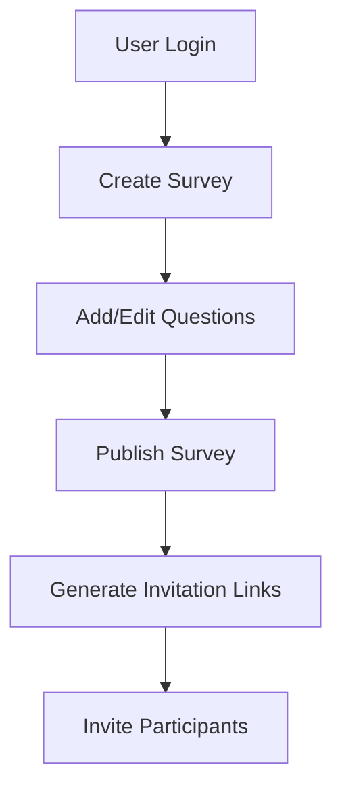
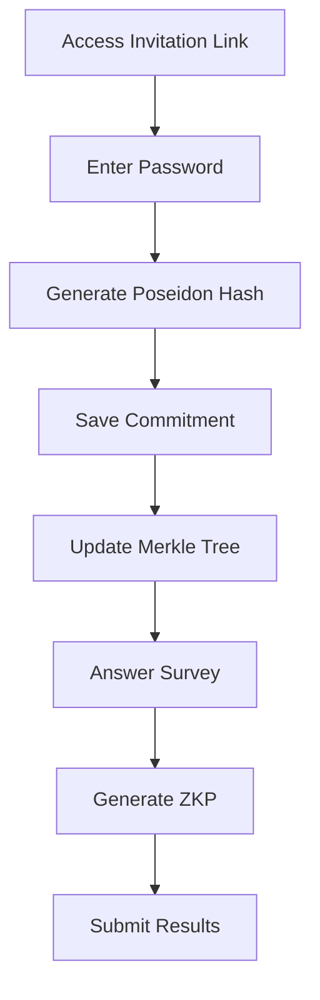
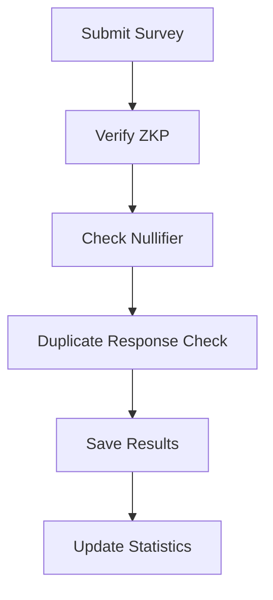

# ZK Survey - Zero-Knowledge Proof Based Anonymous Survey Platform

<div align="center">


**Anonymous Survey Platform for Privacy Protection**

</div>

## 📋 Project Overview

ZK Survey is a platform that leverages **Zero-Knowledge Proof (ZKP)** technology to provide trustworthy survey results while completely protecting participants' personal information.

### 🎯 Key Features

- 🔒 **Complete Anonymity**: Survey participation without collecting personal information
- 🛡️ **Duplicate Response Prevention**: Reliable verification through ZKP
- 📊 **Real-time Statistics**: Real-time analysis and visualization of survey results
- 🎨 **Intuitive UI**: User-friendly survey creation and management interface
- 🔐 **Enhanced Security**: Encryption using Poseidon Hash and Merkle Tree

## 🏗️ Architecture

```
┌─────────────────┐    ┌─────────────────┐    ┌─────────────────┐
│   Frontend      │    │   Backend       │    │   Database      │
│   (Next.js)     │◄──►│   (NestJS)      │◄──►│   (MySQL)       │
│                 │    │                 │    │                 │
│ • React 18      │    │ • TypeScript    │    │ • Survey Data   │
│ • Tailwind CSS  │    │ • TypeORM       │    │ • User Data     │
│ • shadcn/ui     │    │ • JWT Auth      │    │ • ZK Proofs     │
│ • ZK Libraries  │    │ • ZK Verification│   │ • Merkle Trees  │
└─────────────────┘    └─────────────────┘    └─────────────────┘
```

## 🔄 System Flow

### 1. Survey Creation and Management



### 2. Survey Participation Process



### 3. Zero-Knowledge Proof Verification



## 🚀 Main Features

### 📝 Survey Management

- **Survey Creation**: Support for various question types (text, single choice, multiple choice, rating)
- **Survey Editing**: Freely modify surveys in draft status
- **Survey Publishing**: Only active surveys can be participated in
- **Survey Closing**: Change to status where no further participation is possible

### 🔗 Invitation System

- **Individual Invitations**: Generate unique invitation links per email
- **UUID Management**: Assign unique UUID to each invitation
- **Status Tracking**: Manage PENDING, SENT, OPENED states

### 🔐 Security System

- **Poseidon Hash**: Generate hash combining password and UUID
- **Merkle Tree**: Efficient commitment management
- **Zero-Knowledge Proof**: Identity verification without exposing personal information
- **Nullifier**: Prevent duplicate responses

### 📊 Result Analysis

- **Real-time Statistics**: Response statistics and ratios by question
- **Individual Responses**: Check each participant's answers
- **Visualization**: Intuitive charts and graphs
- **Data Export**: Download result data

## 🛠️ Technology Stack

### Frontend

- **Next.js 15**: App Router based React framework
- **TypeScript**: Type safety guarantee
- **Tailwind CSS**: Utility-first CSS framework
- **shadcn/ui**: Modern UI component library
- **@aztec/bb.js**: Zero-Knowledge Proof library
- **@noir-lang/noir_js**: ZK Circuit execution environment

### Backend

- **NestJS**: TypeScript based Node.js framework
- **TypeORM**: Database ORM
- **MySQL**: Relational database
- **JWT**: Authentication token management
- **UUID**: Unique identifier generation

### Cryptography

- **Poseidon Hash**: Efficient hash function
- **Merkle Tree**: Data integrity verification
- **Zero-Knowledge Proof**: Privacy protection
- **Nullifier**: Duplicate prevention mechanism

## 📦 Installation and Setup

### Prerequisites

- Node.js 18+
- MySQL 8.0+
- Yarn

### 1. Clone Repository

```bash
git clone <repository-url>
cd zk-survey
```

### 2. Install Dependencies

```bash
# From root directory
yarn install

# Or from individual packages
cd packages/frontend && yarn install
cd packages/backend && yarn install
```

### 3. Environment Variables

```bash
# packages/backend/.env
DATABASE_HOST=localhost
DATABASE_PORT=3306
DATABASE_USERNAME=your_username
DATABASE_PASSWORD=your_password
DATABASE_NAME=zk_survey
JWT_SECRET=your_jwt_secret
GOOGLE_CLIENT_ID=your_google_client_id
GOOGLE_CLIENT_SECRET=your_google_client_secret

# packages/frontend/.env.local
NEXT_PUBLIC_BACKEND_URL=http://localhost:9111
```

### 4. Database Setup

```sql
CREATE DATABASE zk_survey;
```

### 5. Run Application

```bash
# Development mode
yarn dev

# Or run individually
# Backend
cd packages/backend && yarn start:dev

# Frontend
cd packages/frontend && yarn dev
```

## 📁 Project Structure

```
zk-survey/
├── packages/
│   ├── frontend/                 # Next.js Frontend
│   │   ├── app/                 # App Router Pages
│   │   ├── components/          # React Components
│   │   ├── hooks/              # Custom React Hooks
│   │   ├── services/           # API Services
│   │   ├── lib/                # Utility Functions
│   │   └── store/              # State Management
│   │
│   └── backend/                 # NestJS Backend
│       ├── src/
│       │   ├── modules/        # Feature Modules
│       │   │   ├── survey/     # Survey Management
│       │   │   ├── auth/       # Authentication
│       │   │   ├── member/     # User Management
│       │   │   ├── merkletree/ # Merkle Tree
│       │   │   └── verify/     # ZK Verification
│       │   ├── common/         # Common Modules
│       │   └── main.ts         # Application Entry Point
│       └── test/               # Test Files
│
├── docs/                       # Documentation
├── scripts/                    # Scripts
└── README.md                   # Project Description
```

## 🔐 Security Mechanisms

### Zero-Knowledge Proof Flow

1. **Commitment Generation**: Password + UUID → Poseidon Hash
2. **Merkle Tree Update**: Add commitment to tree
3. **Proof Generation**: Generate proof through ZK Circuit
4. **Verification**: Prevent duplicates through nullifier

### Privacy Protection

- **Anonymous Participation**: Survey participation without collecting personal information
- **Encrypted Storage**: Encrypt sensitive data storage
- **Access Control**: Permission-based data access restrictions

## 📊 API Documentation

### Survey Management

- `POST /api/v1/survey` - Create survey
- `PUT /api/v1/survey/:id` - Update survey
- `GET /api/v1/survey` - Get my surveys
- `GET /api/v1/survey/:id` - Get survey details
- `PUT /api/v1/survey/:id/status` - Update survey status

### Invitation Management

- `POST /api/v1/survey/:id/invitation` - Create invitation
- `GET /api/v1/survey/invitation/:uuid` - Get survey information
- `POST /api/v1/survey/invitation/:uuid/commitment` - Save commitment
- `POST /api/v1/survey/invitation/:uuid/commitment/verify` - Verify commitment

### Survey Participation

- `POST /api/v1/survey/:uuid/submit` - Submit survey
- `GET /api/v1/survey/:id/results` - Get survey results

## 🤝 Contributing

1. Fork the Project
2. Create your Feature Branch (`git checkout -b feature/AmazingFeature`)
3. Commit your Changes (`git commit -m 'Add some AmazingFeature'`)
4. Push to the Branch (`git push origin feature/AmazingFeature`)
5. Open a Pull Request

## 📄 License

This project is distributed under the MIT License. See the `LICENSE` file for details.

## 📞 Contact

If you have any questions about the project, please create an issue.

---

<div align="center">

**ZK Survey** - Innovative Survey Platform for Privacy Protection

</div>
